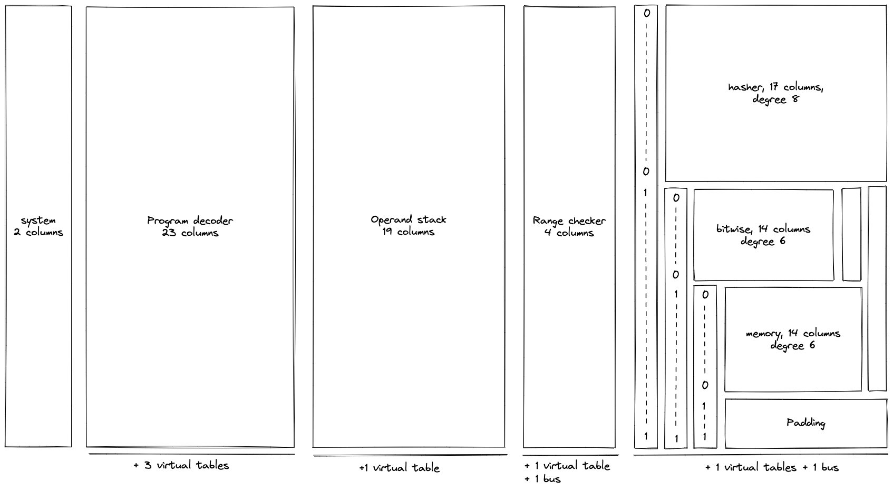

# Design
In the following sections, we provide in-depth descriptions of Miden VM internals, including all AIR constraints for the proving system. We also provide rationale for making specific design choices.

Throughout these sections we adopt the following notations and assumptions:
* All arithmetic operations, unless noted otherwise, are assumed to be in a prime filed with modulus $p = 2^{64} - 2^{32} + 1$.
* A _binary_ value means a field element which is either $0$ or $1$.
* We use lower-case letters to refer to individual field elements (e.g., $a$), and upper-case letters to refer to groups of $4$ elements or words (e.g., $A$). To refer to individual elements within a word, we use numerical subscripts. For example, $a_0$ is the first element of word $A$, $b_3$ is the last element of word $B$, etc.
* When describing AIR constraints:
  - For a column $x$, we denote the value in the current row simply as $x$, and the value in the next row of the column as $x'$. Thus, all transition constraints for Miden VM work with two consecutive rows of the execution trace.
  - For multiset equality constraints, we denote random values sent by the verifier after the prover commits to the main execution trace as $\alpha_0, \alpha_1, \alpha_2$ etc.

## VM components
Miden VM consists of several interconnected components, each providing a specific set of functionality. These components are:

* **Program decoder**, which is responsible for computing a commitment to the executing program and converting the program into a sequence of operations executed by the VM.
* **Operand stack**, which is a push-down stack which provides operands for all operations executed by the VM.
* **Range checker**, which is responsible for providing 16-bit range checks needed by other components.
* **Chiplets**, which is a set of specialized circuits used to accelerate commonly-used complex computations. Currently, the VM relies on 3 chiplets:
  - Hash chiplet, used to compute Rescue Prime hashes both for sequential hashing and for Merkle tree hashing.
  - Bitwise chiplet, used to compute bitwise operations (e.g., `AND`, `XOR`) over 32-bit integers.
  - Memory chiplet, used to support random-access memory in the VM.

The above components are connected via **buses**, which are implemented using [multiset checks](./multiset.md). We also use multiset checks internally within components to describe **virtual tables**.

## VM execution trace
Execution trace of Miden VM consists of $66$ main trace columns, $2$ buses, and $6$ virtual tables as shown in the diagram below.

As can be seen from the above, decoder, stack, and range checker components use dedicated sets of columns, while all chiplets share the same $18$ columns. To differentiate between chiplets, we use a set of binary selector columns, a combination of which uniquely identifies each chiplet.

In addition to the components described previously, execution trace also contains $2$ system columns:

* `clk` which is used to keep track of the current VM cycle. Values in these columns start out at $0$ and are incremented with each cycle.
* `fmp` which contains the value of the free memory pointer used for specifying the region of memory available to procedure locals.

AIR constraints for the `fmp` column are described in [system operations](./stack/system_ops.md) section. For the `clk` column, the constraints are straightforward:

>$$
clk' - (clk + 1) = 0 \text{ | degree } = 1
$$

We frequently use the above notation for describing other AIR constraints. Specifically, the constraint is followed by its implied algebraic degree.